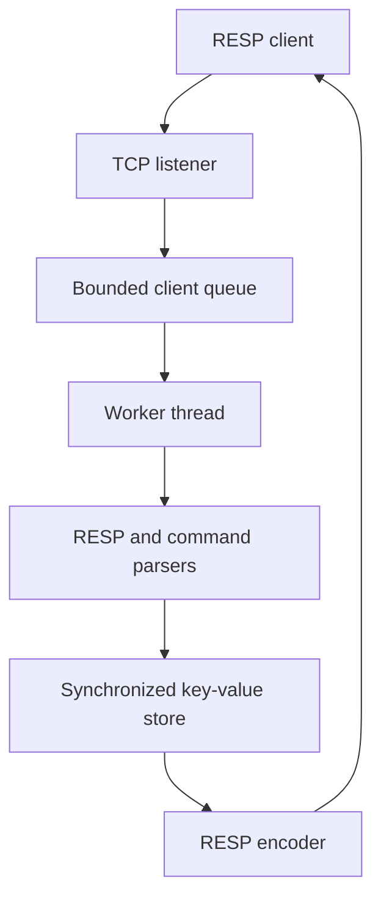

# Mini Redis in C++

A Redis-inspired key-value server implemented in C++17 for Windows. The project explores TCP networking, protocol framing, concurrency, persistence, resource ownership, and automated testing.

It implements a focused subset of Redis commands and partial RESP2 compatibility. It is an educational portfolio project, not a production replacement for Redis.

## Features

* TCP server listening on `127.0.0.1:6379`
* Partial Redis Serialization Protocol (RESP2) support
* Handles fragmented and pipelined TCP commands
* Thread-safe in-memory key-value storage
* Optional key expiration using TTL
* Snapshot persistence between server restarts
* Fixed-size worker pool with a bounded client queue
* Client inactivity timeout
* Maximum command-size protection
* RAII management for Winsock and socket resources
* Unit and real loopback TCP integration tests
* Strict compiler warnings

## Supported commands

| Command                    | Description                            |
| -------------------------- | -------------------------------------- |
| `PING`                     | Check whether the server is responding |
| `SET key value`            | Store a value                          |
| `SET key value EX seconds` | Store a value with a TTL               |
| `GET key`                  | Retrieve a value                       |
| `DEL key`                  | Delete a key                           |
| `EXISTS key`               | Check whether a key exists             |
| `HELP`                     | Return the supported command list      |
| `EXIT`                     | Close the current client connection    |

Command names are case-insensitive. Keys and values preserve their original case.

## Architecture



The server uses four worker threads and accepts up to 32 pending client connections. A mutex protects command execution and snapshot persistence. Network responses are sent after releasing the storage lock so slow clients do not block access to shared state.

Each client has a 60-second receive timeout. Commands larger than 4096 bytes are rejected to prevent an unfinished request from consuming unlimited memory.

## RESP examples

A `PING` request:

```text
*1\r\n
$4\r\n
PING\r\n
```

Response:

```text
+PONG\r\n
```

A successful `GET name` response containing `Alice`:

```text
$5\r\n
Alice\r\n
```

A missing value is represented as a RESP null bulk string:

```text
$-1\r\n
```

## Requirements

* Windows 10 or Windows 11
* CMake 3.16 or newer
* C++17-compatible compiler
* MinGW-w64 GCC or MSVC
* Git, if cloning from GitHub

The project was primarily developed and tested using MinGW-w64 on Windows.

## Build

Clone the repository:

```powershell
git clone https://github.com/Magomed18/mini-redis-cpp.git
cd mini-redis-cpp
```

Configure with MinGW:

```powershell
cmake -S . -B build-gcc -G "MinGW Makefiles"
```

Build:

```powershell
cmake --build build-gcc
```

Run all tests:

```powershell
ctest --test-dir build-gcc --output-on-failure
```

Start the server:

```powershell
.\build-gcc\mini_redis.exe
```

## Testing

The project contains six automated test executables:

* Key-value store tests
* Command parser tests
* Command executor tests
* RESP parser tests
* RESP encoder tests
* TCP client-session integration tests

The integration test creates a real Winsock loopback connection on an automatically selected temporary port. It verifies lowercase command handling, RESP responses, pipelining, storage operations, and connection closing.

## Persistence

The server loads data from `snapshot.txt` at startup. Successful `SET` and `DEL` operations update the snapshot.

Expired TTL entries are treated as missing and are not returned by `GET` or `EXISTS`.

`snapshot.txt` is runtime data and is intentionally excluded from Git.

## Project structure

```text
src/
  client_session.*       TCP receive, framing, execution, and response loop
  client_worker_pool.*   Bounded worker pool and client queue
  command_executor.*     Command behavior
  command_parser.*       Command argument validation and normalization
  key_value_store.*      Storage, TTL, and snapshot persistence
  resp_parser.*          RESP request decoding
  resp_encoder.*         RESP response encoding
  socket_handle.*        Move-only socket RAII wrapper
  winsock_runtime.*      Winsock lifetime management
  main.cpp               Server startup and accept loop

test/
  Unit and TCP integration tests
```

## Current limitations

* Windows/Winsock only
* Partial RESP2 support rather than the complete Redis protocol
* One key per `DEL` or `EXISTS` command
* Fixed worker and queue sizes
* Snapshot persistence is not Redis RDB or AOF
* Snapshot writes currently occur while holding the storage mutex
* No authentication, transactions, replication, eviction policy, or clustering

These constraints deliberately keep the project focused on core C++ server-engineering concepts.

## Tech used in this project

* Modern C++17
* RAII and move-only resource ownership
* TCP stream framing
* Partial `send()` and `recv()` handling
* RESP parsing and serialization
* Thread pools, mutexes, and condition variables
* Bounded queues and overload protection
* Persistent storage and TTL expiration
* Unit and integration testing with CMake/CTest
* Git feature-branch workflow
