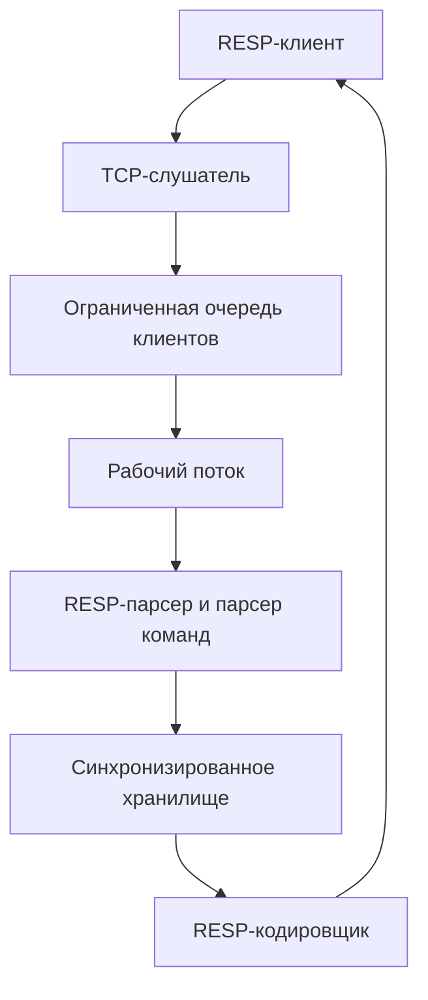

# Mini Redis на C++

[English](README.md) | **Русский**

Redis-подобный сервер ключ-значение, реализованный на C++17 для Windows. Проект демонстрирует работу с TCP-сетями, фреймингом протокола, многопоточностью, персистентностью данных, управлением ресурсами и автоматизированным тестированием.

Сервер реализует ограниченный набор команд Redis и частичную совместимость с RESP2. Это учебный портфолио-проект, а не замена Redis для промышленной эксплуатации.

## Возможности

* TCP-сервер на `127.0.0.1:6379`
* Частичная поддержка Redis Serialization Protocol (RESP2)
* Обработка фрагментированных и конвейерных TCP-команд
* Потокобезопасное хранилище ключ-значение в памяти
* Время жизни ключей — TTL
* Сохранение снимка данных между перезапусками
* Фиксированный пул рабочих потоков и ограниченная очередь клиентов
* Тайм-аут неактивности клиента
* Ограничение максимального размера команды
* RAII-управление Winsock и сокетами
* Модульные и интеграционные TCP-тесты
* Строгие предупреждения компилятора

## Поддерживаемые команды

| Команда                    | Описание                              |
| -------------------------- | ------------------------------------- |
| `PING`                     | Проверить, отвечает ли сервер         |
| `SET key value`            | Сохранить значение                    |
| `SET key value EX seconds` | Сохранить значение с TTL              |
| `GET key`                  | Получить значение                     |
| `DEL key`                  | Удалить ключ                          |
| `EXISTS key`               | Проверить существование ключа         |
| `HELP`                     | Получить список поддерживаемых команд |
| `EXIT`                     | Закрыть текущее клиентское соединение |

Имена команд не зависят от регистра. Регистр ключей и значений сохраняется.

## Архитектура



Сервер использует четыре рабочих потока и очередь до 32 ожидающих клиентских соединений. Мьютекс защищает выполнение команд и запись снимка данных. Сетевой ответ отправляется после освобождения блокировки, поэтому медленный клиент не удерживает доступ к общему хранилищу.

Для каждого клиента установлен 60-секундный тайм-аут чтения. Команды размером более 4096 байт отклоняются, чтобы незавершённый запрос не мог бесконечно увеличивать потребление памяти.

## Примеры RESP

Запрос `PING`:

```text
*1\r\n
$4\r\n
PING\r\n
```

Ответ:

```text
+PONG\r\n
```

Успешный ответ `GET name`, содержащий `Alice`:

```text
$5\r\n
Alice\r\n
```

Отсутствующее значение представляется как нулевая bulk-строка RESP:

```text
$-1\r\n
```

## Требования

* Windows 10 или Windows 11
* CMake 3.16 или новее
* Компилятор с поддержкой C++17
* MinGW-w64 GCC или MSVC
* Git для клонирования репозитория

Основная разработка и тестирование проекта выполнялись с MinGW-w64 на Windows.

## Сборка

Клонируйте репозиторий:

```powershell
git clone https://github.com/Magomed18/mini-redis-cpp.git
cd mini-redis-cpp
```

Сконфигурируйте проект для MinGW:

```powershell
cmake -S . -B build-gcc -G "MinGW Makefiles"
```

Соберите проект:

```powershell
cmake --build build-gcc
```

Запустите все тесты:

```powershell
ctest --test-dir build-gcc --output-on-failure
```

Запустите сервер:

```powershell
.\build-gcc\mini_redis.exe
```

## Тестирование

Проект содержит шесть автоматизированных тестовых исполняемых файлов:

* Тесты хранилища ключ-значение
* Тесты парсера команд
* Тесты исполнителя команд
* Тесты RESP-парсера
* Тесты RESP-кодировщика
* Интеграционные тесты TCP-сессии

Интеграционный тест создаёт реальное loopback-соединение Winsock на автоматически выбранном временном порте. Он проверяет команды в нижнем регистре, RESP-ответы, конвейерную обработку, операции с хранилищем и закрытие соединения.

## Персистентность

При запуске сервер загружает данные из `snapshot.txt`. Успешные операции `SET` и `DEL` обновляют снимок.

Ключи с истёкшим TTL считаются отсутствующими и не возвращаются командами `GET` и `EXISTS`.

`snapshot.txt` содержит данные времени выполнения и намеренно исключён из Git.

## Структура проекта

```text
src/
  client_session.*       Приём данных, фрейминг и обработка TCP-сессии
  client_worker_pool.*   Пул рабочих потоков и очередь клиентов
  command_executor.*     Выполнение команд
  command_parser.*       Проверка аргументов и нормализация команд
  key_value_store.*      Хранилище, TTL и запись снимков
  resp_parser.*          Декодирование RESP-запросов
  resp_encoder.*         Кодирование RESP-ответов
  socket_handle.*        Move-only RAII-обёртка над сокетом
  winsock_runtime.*      Управление временем жизни Winsock
  main.cpp               Запуск сервера и цикл accept()

test/
  Модульные и интеграционные TCP-тесты
```

## Текущие ограничения

* Поддерживается только Windows/Winsock
* Реализована часть RESP2, а не полный протокол Redis
* Команды `DEL` и `EXISTS` принимают только один ключ
* Размеры пула потоков и очереди фиксированы
* Снимок данных не является форматом Redis RDB или AOF
* Запись снимка выполняется при удержании мьютекса хранилища
* Нет аутентификации, транзакций, репликации, политики вытеснения и кластеризации

Эти ограничения выбраны намеренно, чтобы сохранить фокус проекта на основных концепциях разработки серверных приложений на C++.

## Продемонстрированные инженерные навыки

* Современный C++17
* RAII и move-only владение ресурсами
* Фрейминг данных в TCP-потоке
* Обработка частичных операций `send()` и `recv()`
* Парсинг и сериализация RESP
* Пулы потоков, мьютексы и условные переменные
* Ограниченные очереди и защита от перегрузки
* Персистентное хранение и TTL
* Модульное и интеграционное тестирование через CMake/CTest
* Работа с feature-ветками Git
